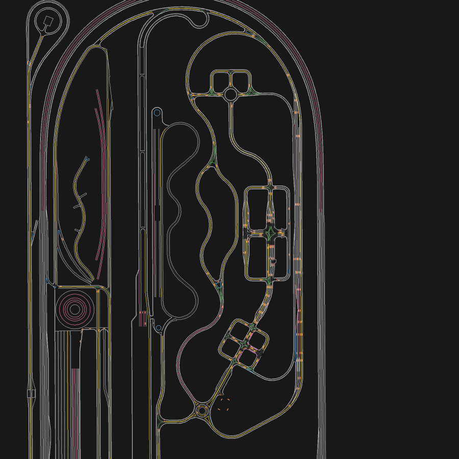

# KATRI 맵 (MGeo) — 무엇이 있고 무엇이 없나

> **문서 역할:** 정본 — 우리가 받은 맵 데이터의 내용·좌표계·한계
> **담당:** 안승현
> **기계 정본:** `../data/KATRI 맵 데이터 자료/` (저장소 밖)
> **최종 수정:** 2026-09-23

## 1. 결론 먼저 — 주차칸 선은 "맵에 있는데 우리가 못 받았다"

받은 폴더에는 **주차면 기하가 없다.** 그런데 `global_info.json` 안의 `mgeo_file_hash` 에는 MORAI
가 내보낸 **39개 파일의 목록과 SHA-256** 이 그대로 남아 있고, 거기에 `parking_space_set.json` 이
**내용 있는 파일로** 기록돼 있다.

| 파일 | 기록된 sha256 (앞 16) | 폴더에 | 해석 |
|---|---|---|---|
| `parking_space_set.json` | `0d410f76591ad9bd` | **없음** | **내용 있음 · 미전달** |
| `object_set.json` | `ee3a8f6aed261977` | 없음 | 내용 있음 · 미전달 |
| `road_polygon_set.json` | `4f53cda18c2baa0c` | 없음 | 원래 빈 배열 `[]` |
| `road_set.json` | `4f53cda18c2baa0c` | 없음 | 원래 빈 배열 |
| `junction_set.json` / `junction_group_set.json` | `4f53cda18c2baa0c` | 없음 | 원래 빈 배열 |
| `ErrorLinkPath.txt` | `e3b0c44298fc1c14` | 없음 | 원래 빈 파일 |

`4f53cda18c2baa0c…` 는 `[]` 의 SHA-256, `e3b0c442…` 는 빈 파일의 SHA-256 이다.
`parking_space_set.json` 의 해시는 **둘 다와 다르다.** 즉 빈 파일이 아니다.

```bash
# 언제든 1초에 재확인
python3 src/vip3_hd_map/scripts/inspect_katri_mgeo.py \
  --map-dir "../data/KATRI 맵 데이터 자료" --check
```

### 그래서 할 일

**모라이 측 또는 원종훈 교수님께 `parking_space_set.json` 과 `object_set.json` 을 요청한다.**
검증 기준까지 같이 보낸다:

```
parking_space_set.json  sha256 0d410f76591ad9bd028c8950fe79fb07453511446caebecf6a9156280783f25b
object_set.json         sha256 ee3a8f6aed261977a884aa2fb6e930f6e1bd8470f0ea26bd8d376360a82ae125
```

이 파일 하나가 **주차면 GT 를 손으로 찍느냐 / 공짜로 받느냐** 를 가른다. 팀에서 1인이 메일 한 통
쓰는 것으로 끝나는 일인데 레버리지가 가장 크다.

MORAI MGeo 의 `ParkingSpace` 스키마는 이미 확인했다 (MGeoModule `class_defs/parking_space.py`):

```
idx, points, center_point,
parking_type, parking_target_type, parking_direction,
distance, width (기본 2.5), length (기본 5), angle (기본 90),
linked_left_list_idx, linked_right_list_idx
```

`src/vip3_hd_map` 의 로더와 마커 퍼블리셔가 **이 스키마를 그대로 받도록** 미리 만들어 뒀다.
파일이 도착하면 코드 수정 없이 `/vip3_hd_map/global/parking_spaces` 레이어가 켜진다.
직접 찍어야 할 경우를 대비해 `config/vip3_parking_spaces.json` 도 같은 스키마다.

## 2. 지금 가지고 있는 것

| 파일 | 개수 | 내용 |
|---|---:|---|
| `link_set.json` | 667 | 주행 링크 중심선 |
| `node_set.json` | 576 | 링크 노드 |
| `lane_node_set.json` | — | 차선 경계 노드 |
| `lane_boundary_set.json` | 1,579 | **노면 선 (차선·정지선 등)** |
| `surface_marking_set.json` | 238 | 노면 기타 표시 (화살표 등) |
| `crosswalk_set.json` / `singlecrosswalk_set.json` | — | 횡단보도 |
| `traffic_light_set.json` / `synced_traffic_light_set.json` / `traffic_sign_set.json` | — | 신호·표지 (주차엔 불필요) |
| `intersection_controller_set.json` / `_data.json` | — | 교차로 제어 |

**받은 파일 전부가 `global_info.json` 의 해시와 일치한다.** 원본 그대로다. (참고로
`external/2026-ASMC/R_KR_PG_KATRI/` 의 사본은 HD map 큐레이션 과정에서 수정돼 있어
`lane_boundary_set.json` 해시가 다르다 — **우리 사본을 쓴다.**)

### `lane_boundary_set.json` 의 lane_type 분포 (NGII ngii_model2)

| 코드 | 의미 | 개수 |
|---:|---|---:|
| 505 | 길가장자리구역선 | 572 |
| 501 | 중앙선 | 358 |
| 503 | 차선 | 188 |
| 530 | 정지선 | 164 |
| 531 | 안전지대 | 121 |
| 525 | 유도선 | 74 |
| 506 | 진로변경제한선 | 52 |
| **535** | **미확정** (아래 참고) | **27** |
| 515 | 좌회전유도차선 | 17 |
| 599 / 504 | 기타 / 버스전용 | 3 / 3 |

**535 의 의미는 확정하지 못했다.** 27개가 `(82.2, 1190.2)` 주변 60×90 m 에 흩어져 있다.
centroid 기준 반경의 표준편차/평균 = **0.536** 이고 방위 12분할 중 2칸이 비어 있어 **링이
아니다** (회전교차로 도색이면 0 에 가까워야 한다). 주차 규격(2.3~2.5 m × 5.0 m 평행 반복)도
아니다. NGII B2_SURFACELINEMARK 코드표 원문으로 확인하기 전까지 `UNVERIFIED_535` 로 둔다.

**어느 쪽이든 주차면 기하는 아니다.** 5 m 짜리 짧은 선이 2.5 m 간격으로 반복되는 주차장
패턴은 맵 어디에도 없다 — 짧은(3~8 m) 세그먼트를 25 m 격자로 세었을 때 최대 밀도가 11개이고
구성도 530(정지선) 위주다. 주차장 한 구획(10칸)이면 한 셀에 평행선 20~40개가 나와야 한다.
515 / 531 / 5379 / 5381 / 5382 / 5431 / 5432 도 같은 이유로 `UNVERIFIED_` 로 둔다.

## 3. 좌표계 — 이걸 틀리면 전부 틀어진다

`global_info.json`:

```
global_coordinate_system  = "+proj=utm +zone=52 +ellps=WGS84 +units=m +no_defs"   (EPSG:32652)
local_origin_in_global    = [302459.942, 4122635.537, 28.991]
workspace_origin          = [168.0, 1461.0, -72.0]     ← 쓰지 말 것
```

규칙:

1. **모든 MGeo 레이어의 `points` 는 이미 로컬 미터 좌표다.** 변환 없이 RViz `map` frame 에 그대로
   찍는다.
2. **UTM ↔ map**: `map_xy = utm52n_xy − (302459.942, 4122635.537)`
3. **`workspace_origin` 은 MORAI 에디터의 뷰포트 상태다.** 좌표 변환 파라미터가 아니다.
4. GPS lever arm: 센서셋 GPS(id 6) 가 x = 0.350 m 이므로 `base_link` 로 옮길 때 그만큼 뺀다.
5. **원점의 WGS84 위경도 = 37.2293241 N, 126.7732979 E.** `gps_transform.gps_to_utm52n` 을
   수치로 역산한 값이고 `test_live_pose.py::test_katri_origin_round_trips` 가 1 cm 이내로
   검증한다. `rostopic echo -n1 /gps` 값이 이 근처(±3 km)가 아니면 맵이나 차량 스폰 위치가
   KATRI 가 아니다 — 원점 오프셋을 의심하기 전에 이걸 먼저 본다.

실측 범위: x [−534.6, 379.7], y [−249.1, 2130.4], z [−6.1, 5.8]. 약 0.9 km × 2.4 km.

**확인할 것:** `/Ego_topic.position` 이 이 로컬 원점과 같은 원점을 쓰는지. 차를 링크 위에 세우고
`rostopic echo -n1 /Ego_topic` 의 position 으로 가장 가까운 link 까지 거리를 재면 된다. 1 m 이내면
일치, 수백 m 면 오프셋이 있는 것이고 그때 `~map_origin_offset_xy` 를 쓴다. 시각화 노드가 이걸
자동으로 경고한다(`~pose_distance_warning_m`).

GT 없이 교차검증하려면 `pose_source:=gps_imu` 로 띄운다. `/gps` 를 UTM52N 으로 올린 뒤
위 원점을 빼고 `/imu` yaw 로 lever arm 을 제거해 `base_link` 를 만든다. 이때 MORAI 가
`GPSMessage.eastOffset/northOffset` 에 실어 보내는 원점을 위 값과 한 번 비교해서 1 m 넘게
다르면 `logerr` 를 낸다 — **맵과 차량이 서로 다른 원점을 쓰는 경우를 잡는 유일한 자동 검사다.**

## 4. K-City 구간

`../data/KATRI 맵(K-CITY 구간 한정) 주행 가능 영역 자료/` 는 KATRI 안의 **K-City 도심 구간만**
덮는 주행 가능 영역 폴리곤이다 (`road_mesh_out_line.json`, 외곽 1 + 내부 홀 23 —
`concrete_curb` 11, `intersection` 10, `circular_intersection` 2).

범위: x [−162, 222], y [953, 2037]. 전체 맵의 일부다.



위 그림은 `tools/render_mgeo_map.py` 출력이다 (시뮬레이터 불필요):

```bash
python3 tools/render_mgeo_map.py --mgeo "../data/KATRI 맵 데이터 자료" \
  --out /tmp/katri.png --scale 1.5
# 관심 구역만 크게
python3 tools/render_mgeo_map.py --mgeo "../data/KATRI 맵 데이터 자료" \
  --out /tmp/zoom.png --center 80 1190 --radius 80 --scale 20
```

## 5. RViz 시각화

```bash
roslaunch vip3_hd_map katri_map_viz.launch                      # 전체 + ego 주변
roslaunch vip3_hd_map katri_map_viz.launch local_radius_m:=15.0 # 주차 근접
roslaunch vip3_hd_map katri_map_viz.launch publish_global:=true rviz:=false
```

토픽은 전부 stock `visualization_msgs/MarkerArray` 다. 커스텀 메시지를 쓰지 않으므로 RViz 만
있으면 누구나 본다. 자세한 것은 `src/vip3_hd_map/README.md`.

## 6. 남은 확인 사항

- [ ] **`parking_space_set.json` 요청 → 수령** — 안승현이 추석 연휴 이후 문의
- [ ] MORAI SIM 에서 R_KR_PG_KATRI 를 열었을 때 **3D 씬에 주차장이 실제로 렌더링되는가.**
      MGeo 는 도로망 레이어일 뿐이라 벡터가 없어도 씬에는 있을 수 있다. 있다면 그 위치를 RViz 에서
      좌표로 찍어 `config/vip3_parking_spaces.json` 의 출발점으로 삼는다.
      **이 확인 없이는 "주차를 어디서 하는가" 자체가 미정이다.**
- [ ] `/Ego_topic.position` 원점이 MGeo local frame 과 같은가
- [ ] KATRI ego 차량 실제 치수 (전장·전폭·휠베이스·**후륜축→후범퍼 오버행**).
      후진 주차에서 실제로 부딪히는 지점이다.
