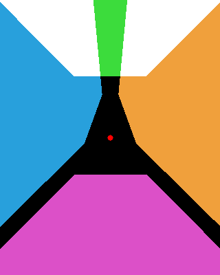
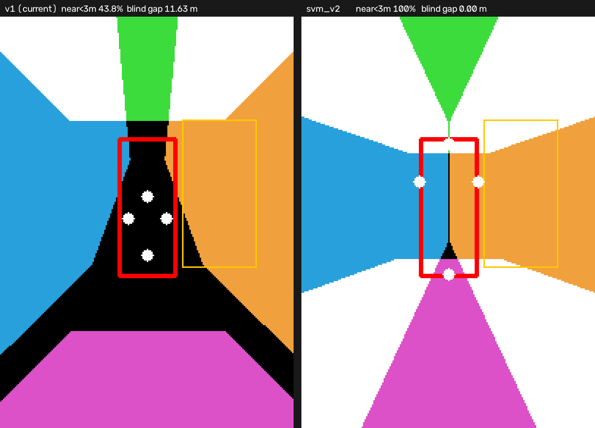

# 센서셋 — VIP3_sensor_set_v1 (임시)

> **문서 역할:** 정본 — 지금 쓰는 센서 구성과 그 한계
> **담당:** 강도균 (센서셋) · 안승현 (기하·BEV)
> **기계 정본:** `config/VIP3_sensor_set_v1_ros.json`, `config/vip3_topics.yaml`
> **최종 수정:** 2026-09-23

## 1. 상태

**이 센서셋은 임시다.** 기반 논문과 인지 모델이 정해지면 바꾼다. 지금은 "무엇이든 하나 정해서
코드가 돌게 만드는" 용도다. 아래 §4의 사각 분석이 다음 센서셋 설계의 근거다.

원본은 로컬 루트 `../data/VIP3_sensor_set_v1.json`(UDP 설정)이고, 저장소의
`config/VIP3_sensor_set_v1_ros.json`은 이를 **ROS 전송으로 바꾸고 토픽·frame_id를 팀 규약으로
채운 것**이다. 변환은 재현 가능하다:

```bash
python3 tools/make_ros_sensor_set.py \
  --input  "../data/VIP3_sensor_set_v1.json" \
  --output "config/VIP3_sensor_set_v1_ros.json"
```

MORAI Sensor 설정에서 이 파일을 Import 한다.

> `commType: 3` 이 ROS 를 뜻한다고 보고 변환했다. 근거는 `VIP3_network_v1.json`의 ROS 항목이
> 전부 `netType=3, commType=3`이고, MORAI gRPC proto 의 `NetworkCommType` 이
> `UNSPECIFIED=0, UDP=1, TCP=2, ROS=3, ...` 이기 때문이다. **센서 열거가 같은지는 시뮬레이터에서
> 한 번만 확인하면 된다** — UI 에서 카메라 하나를 손으로 ROS 로 바꿔 Export 한 뒤
> `cameraList[0].cc.commType` 값을 보면 끝난다. 다르면 `--comm-type <값>` 으로 다시 돌린다.

## 2. 구성

base_link = **뒷바퀴축 중심**, x 전방 · y 좌 · z 상 (REP-103).

| ID | 센서 | 위치 (x,y,z) m | 회전 (roll,pitch,yaw) deg | 해상도 / FOV | 토픽 | frame | 주기 |
|---:|---|---|---|---|---|---|---:|
| 1 | front camera | 1.900, 0.000, 1.200 | 0, 2, 0 | 1280×720 / 90° | `/cam_front/image_jpeg/compressed` | `cam_front` | 20 Hz |
| 2 | left camera | 1.150, 0.650, 1.200 | 0, 10, 70 | 640×480 / 130° | `/cam_left/image_jpeg/compressed` | `cam_left` | 20 Hz |
| 3 | right camera | 1.150, −0.650, 1.200 | 0, 10, 290 | 640×480 / 130° | `/cam_right/image_jpeg/compressed` | `cam_right` | 20 Hz |
| 4 | **rear camera** | −0.100, 0.000, 1.200 | 0, 2, 180 | 1280×720 / 90° | `/cam_rear/image_jpeg/compressed` | `cam_rear` | 20 Hz |
| 5 | Lidar3D | 0.800, 0.000, 1.450 | 0, 0, 0 | — | `/velodyne_points` | `velodyne` | 10 Hz |
| 6 | GPS | 0.350, 0.000, 1.250 | 0, 0, 0 | — | `/gps` | `gps` | 5 Hz |
| 7 | IMU | 0.000, 0.000, 0.000 | 0, 0, 0 | — | `/imu` | `imu` | 50 Hz |

카메라 1~3은 ASMC `ASMC_sensor_set_v2` 와 **완전히 같다.** 4번만 다르다 — ASMC 는
(0, 0, 1.400) pitch 328° 의 하향 카메라였고, VIP3 는 후방 카메라다.

## 3. 내부 파라미터 — JSON 값을 믿지 말 것

센서셋 JSON 의 `focalLengthpixel: 320.0` 은 **네 카메라 모두 틀렸다.** 해상도와 FOV 로 다시
계산한다:

```
fx = fy = (width / 2) / tan(horizontal_fov / 2)
cx, cy = width / 2, height / 2        # JSON principalPoint 와 우연히 같다
```

| 카메라 | fx (px) | JSON 값 | 배율 오차 |
|---|---:|---:|---:|
| front / rear | **640.000** | 320.0 | 2.00× |
| left / right | **149.219** | 320.0 | 0.47× |

`lensDistortion`은 네 대 모두 `[0,0,0]` 이라 왜곡 보정이 필요 없다. 핀홀 모델이 **근사가 아니라
정확하다.** BEV 호모그래피(`src/perception/drivable_bev/`)가 이 규칙을 그대로 쓴다.

## 4. 이 센서셋의 한계 — 숫자로

`tools/analyze_sensor_set_coverage.py` 로 계산한다 (시뮬레이터 불필요):

```bash
python3 tools/analyze_sensor_set_coverage.py \
  --sensor-set "../data/VIP3_sensor_set_v1.json" \
  --image /tmp/coverage.png
```

주차 격자 x[−10,10] y[−8,8], 지면 z = −0.35 m 기준:

| 반경 | 어느 카메라든 보이는 비율 | front | left | right | rear |
|---|---:|---:|---:|---:|---:|
| 0–2 m | **9.1 %** | 0 % | 4.6 % | 4.5 % | **0 %** |
| 2–4 m | 69.7 % | 0 % | 27.7 % | 27.7 % | 14.3 % |
| 4–6 m | 91.9 % | 11.9 % | 31.7 % | 31.7 % | 24.8 % |
| 6–8 m | 94.9 % | 19.0 % | 32.9 % | 32.9 % | 24.8 % |

방위별 최근접 가시 지면 거리:

| 방향 | 최근접 | 보는 카메라 |
|---|---:|---|
| 정면 (0°) | 4.50 m | front |
| 좌측 (90°) | 1.75 m | left |
| **후좌 대각 (130°)** | **12.65 m** | ← **사각** |
| 정후방 (180°) | 2.70 m | rear |
| **후우 대각 (230°)** | **12.85 m** | ← **사각** |
| 우측 (270°) | 1.75 m | right |

**결론 세 가지.**

1. **차 반경 1.65 m 안쪽 지면은 어느 카메라에도 안 잡힌다.** 주차칸에 들어가는 마지막 구간이 전부
   여기다.
2. **전방 카메라는 4.5 m 앞부터 본다.** pitch 2° 에 높이 1.2 m 라 그 이상 가까운 노면이 화각 밖이다.
3. **후좌·후우 대각 130°/230° 에 사각 쐐기가 있다.** 좌/우 카메라(화각 130°)와 후방
   카메라(화각 90°) 사이가 벌어져서 생긴다. 후진 주차에서 차가 실제로 향하는 방향이다.

이 결론은 MORAI 의 pitch 부호 규약과 무관하다 — 부호를 반대로 두면 0–2 m 가시율이 9.1 % 에서
**0 %** 로 더 나빠질 뿐이다 (`--pitch-sign -1` 로 확인 가능).



위 그림은 x[−10,10] y[−8,8] 격자다. 위가 전방. 초록 = front, 주황 = left, 파랑 = right,
자홍 = rear, 흰색 = 2대 이상 중복, **검정 = 어느 카메라도 못 보는 곳**, 가운데 빨간 점 =
base_link. 좌우 아래로 뻗은 검은 쐐기 두 개가 후좌·후우 대각 사각이고, 가운데 검은 덩어리가
근접 사각이다.

## 5. SVM(어라운드뷰)으로 가려면 — 권장 v2 배치

주차 슬롯 검출 논문 대부분이 **AVM/SVM 합성 영상**을 입력으로 가정한다. 지금 센서셋은 그
반대 극단이라 카메라 4대를 **위치·자세·화각 전부** 바꿔야 한다. 각도만 틀어서는 안 된다.

`tools/design_svm_sensor_set.py` 가 `drivable_bev` 런타임과 **같은 캘리브레이션 코드**로
후보를 평가한다. 아래 숫자는 전부 그 출력이다.

```bash
python3 tools/design_svm_sensor_set.py --preset svm_v2 \
    --compare config/VIP3_sensor_set_v1_ros.json --image /tmp/svm.png
python3 tools/design_svm_sensor_set.py --sweep          # FOV x pitch 탐색
```

### 권장값

| view | 위치 (x,y,z) m | 회전 (r,p,y) deg | 해상도 | FOV | 어디에 다는 건가 |
|---|---|---|---|---:|---|
| front | **3.700, 0.000, 0.650** | 0, **38**, 0 | 1280×960 | **150** | 앞범퍼 그릴 |
| left | **2.400, 1.000, 1.000** | 0, **55**, 90 | 1280×960 | **150** | 좌측 사이드미러 아래 |
| right | **2.400, −1.000, 1.000** | 0, **55**, −90 | 1280×960 | **150** | 우측 사이드미러 아래 |
| rear | **−0.750, 0.000, 0.950** | 0, **42**, 180 | 1280×960 | **150** | 뒷범퍼/테일게이트 |

내보낸 센서셋: `config/VIP3_sensor_set_v2_svm.json` (sha256 `0c9cd7e6…`)
경량판: `config/VIP3_sensor_set_v2_svm_light.json` (640×480, sha256 `0a936208…`)

### 무엇이 달라지나

| 지표 | v1 (현재) | svm_v2 |
|---|---:|---:|
| 근거리(r<3 m) 가시율 | 43.8 % | **100 %** |
| r<1 m 가시율 | **0 %** | **100 %** |
| 범퍼 밖 사각 폭 (최악) | **11.63 m** | **0.00 m** |
| 격자 전체 (차체 제외) | 83.7 % | **100 %** |
| 2대 이상 중복 (스티칭 여유) | 18.0 % | **52.6 %** |
| 15 cm 주차선 @ 좌 1 m | 23.2 px | 13.7 px |
| 15 cm 주차선 @ 후 1 m | **안 보임** | 13.8 px |
| 15 cm 주차선 @ 후좌 대각 | **안 보임** | 13.7 px |



왼쪽이 현재, 오른쪽이 svm_v2. 격자는 x[−6,8] y[−5,5]. 빨간 사각 = 차체,
노란 사각 = 주차면 한 칸(2.5×5.0 m), **검정 = 사각**, 흰색 = 2대 이상 중복.
왼쪽의 검은 영역이 오른쪽에서 전부 사라지고 차체 둘레가 흰색(중복)으로 바뀐다.

### 왜 이 값인가 — 설계 논리 네 줄

1. **화각이 pitch 보다 훨씬 중요하다.** 차체 바로 옆 지면을 보려면
   `pitch + 수직반각 ≥ 90°` 여야 한다. 수직반각은 수평 FOV 와 종횡비로 정해진다.
   `--sweep` 결과: FOV 150~160 은 pitch 40~70 전 구간에서 성립, FOV 140 은 pitch 45+,
   **FOV 130 은 pitch 65 한 점에서만**, FOV 120 은 어떤 pitch 로도 안 된다.
2. **종횡비를 16:9 → 4:3 으로.** 같은 수평 FOV 에서 수직 화각이 6~8° 더 나온다.
   SVM 은 "지면을 얼마나 아래까지 보는가"가 전부라 종횡비가 FOV 만큼 중요하다.
   (FOV 150 기준 수직반각: 16:9 → 64.5°, 4:3 → 70.3°)
3. **카메라를 낮추고 바깥으로 뺀다.** 현재는 4대 전부 z=1.2 m 에 차 안쪽(x 1.15~1.9)이라
   자기 차체가 시야를 가린다. 실제 AVM 은 그릴(0.65 m) · 미러 아래(1.0 m) ·
   테일게이트(0.95 m)에 단다.
4. **측면 yaw 를 70° → 90° 로.** 정확히 옆을 보게 해야 전/후 카메라와 대각에서 겹친다.
   현재 70°/290° 배치가 후좌 130° · 후우 230° 쐐기를 만든 직접 원인이다.

### ⚠ 먼저 확인할 것 — MORAI 가 FOV 150 을 허용하는가

이 설계 전체가 **초광각 화각**에 달려 있다. MORAI 카메라는 핀홀
(`f = w / (2·tan(fov/2))`)이라 FOV 를 올릴수록 fx 가 작아지고 180°에서 발산한다.
UI 가 어디서 막는지는 **시뮬레이터에서 1분이면 확인된다** — 카메라 하나의 FOV 를
150 으로 올려 저장해 보면 된다.

| UI 최대 FOV | 할 것 |
|---|---|
| ≥ 150 | `svm_v2` 그대로 |
| 140 | pitch 를 45 이상으로 올리면 동등하다 |
| 130 | `svm_v2_fov130` 프리셋. 단 pitch 65 **한 점에서만** 성립해 여유가 없다 |
| < 130 | **SVM 을 포기한다.** 4대로는 360° 근거리를 못 덮는다. 근거리 보조 카메라를 더 다는 쪽이 낫다 |

`lensDistortion`(방사 3계수)과 `modelType` 필드가 있는데 `modelType` 의 의미를 확인하지
못했다. 어안 모델 선택지일 수 있다. **진짜 어안(≥180°)이면 `drivable_bev` 의 호모그래피가
못 다룬다** (`calibration.py` 가 `0 < FOV < 180` 을 강제한다). 어안 모델을 넣으려면
`intrinsic` 과 `ground_to_image_homography` 를 어안 투영으로 바꿔야 하고, 그건 별도 공수다.
**왜곡 계수는 0 으로 두는 것을 권장한다** — 현재 BEV 코드가 왜곡 보정을 하지 않으므로
0 이 아니면 투영이 틀어진다.

### 대역폭 — 여기서 결정이 갈린다

rosbridge 는 이미 최대 미지수다 ([simulator.md](simulator.md) §5). JPEG q90 기준 개략 추정:

| 구성 | @20 Hz | @10 Hz |
|---|---:|---:|
| v1 (현재) | 6.5 MB/s | 3.3 MB/s |
| **svm_v2** (1280×960 ×4) | **13.1 MB/s** | 6.5 MB/s |
| **svm_v2_light** (640×480 ×4) | **3.3 MB/s** | 1.6 MB/s |

**`svm_v2_light` 로 시작할 것을 권한다.** 기하가 완전히 같아서 가시율·사각은 `svm_v2` 와
동일(100 % / 0.00 m)하고, 대역폭은 **현재보다도 절반**이다. 근거리 주차선이 8.6 px 폭으로
잡히므로 검출에 충분하다. 해상도는 모델이 실제로 모자랄 때 올린다.

### 바꾸면 같이 고칠 것

센서셋을 바꾸면 네 곳이 같이 바뀐다. 하나라도 빠지면 BEV 가 조용히 틀린다
([architecture.md](architecture.md) §5):

1. `config/VIP3_sensor_set_v2_svm*.json` — MORAI 에서 Import
2. `config/vip3_topics.yaml` — 위치·회전·해상도·FOV
3. `src/perception/drivable_bev/config/cameras_vip3_v1.yaml` — **`source_sha256` 포함**
4. `src/vip3_bringup/launch/static_tf.launch` — `python3 tools/dump_static_tf.py` 출력으로 교체

그리고 **BEV 격자를 다시 볼 것.** 지금은 `x[−10,10] y[−8,8]` 인데 SVM 은 근거리가
촘촘해지는 대신 원거리 해상도가 떨어지므로 `x[−6,8] y[−5,5] res 0.03` 쪽이 맞을 수 있다.
`--image` 출력으로 주차면 한 칸이 어떻게 들어오는지 보고 정한다.

> **TwinLiteNet+ 가중치는 이 배치에서 성능이 떨어진다.** 학습 데이터가 K-City 주행 영상
> (전방 90° / 측면 130°, 거의 수평)이라 150° 를 55° 숙인 영상은 분포 밖이다. SVM 으로
> 가는 순간 **재학습 또는 모델 교체가 전제**가 된다 — 하수영의 기반 논문 선정과 묶어서
> 결정할 것.

### 아직 남는 한계

- **차체 자가 가림을 모델링하지 못했다.** 이 분석은 지면 평면만 본다. 실제로는 범퍼·미러가
  화면 하단을 가린다. 시뮬레이터에서 실제 영상을 봐야 확정된다.
- **스티칭은 별도 작업이다.** 4장을 한 장으로 합치려면 `drivable_bev` 의 융합 결과
  (`/perception/bev/camera/*`)를 쓰거나, RGB 서라운드(`rgb_bev_node.py`)를 쓴다.
  후자가 이미 돌아가므로 SVM 영상이 필요하면 그쪽을 먼저 본다.
- 지면 평면 가정 때문에 **주차된 옆 차는 시선 방향으로 길게 번진다.** SVM 이어도 같다.
  LiDAR 점유로 보정하는 것이 정석이다.

## 6. Semantic 카메라 (강도균 파트)

MORAI Capture Mode 를 쓰면 **장착된 RGB 카메라마다** Intensity / Semantic / Instance / Depth PNG
가 한 번에 나온다. 즉 **학습 GT 만 필요하면 Semantic 카메라를 따로 달 필요가 없다.**

실시간 ROS Semantic 스트림이 필요할 때만 추가한다. 그때 지킬 것:

- `m_SensorUniqueID` 는 8, 9, 10, 11 (기존 1~7 과 충돌 금지)
- **`cc.cameraType: 1`** 이 Semantic (RGB 는 0)
- `pos` / `rot` / 해상도 / FOV 를 짝이 되는 RGB 카메라와 **완전히 동일하게** 복사
- 토픽은 `/sem_front/...`, `/sem_left/...`, `/sem_right/...`, `/sem_rear/...`
- **무손실이어야 한다.** 마스크 생성기가 클래스 색을 정확히 일치 비교하므로 JPEG 압축이 한 번이라도
  끼면 전부 깨진다. 안티에일리어싱도 꺼야 한다.
- MORAI 팔레트에 **주차칸 선 전용 클래스가 없다.** 주차 슬롯 라인은 `white_lane (255,255,255)`
  또는 `yellow_lane (255,255,0)` 로 칠해질 가능성이 높다. **이게 실제로 무슨 색인지 확인하는 것이
  팀 전체의 가장 싼 결정적 실험이다** — KATRI 주차장에서 캡처 한 장이면 된다.

## 7. 확인해야 할 것 (첫 연동 때)

- [ ] 센서 `commType` ROS 열거값이 3 인가
- [ ] 카메라 토픽에 `/compressed` 가 자동으로 붙는가, 아니면 전체 문자열을 써야 하는가
- [ ] `rostopic hz` 로 카메라 4대 실제 수신율. rosbridge 는 base64 JSON 이라 20 Hz × 4대가
      안 나올 가능성이 높다 → [simulator.md](simulator.md) §5 의 완화 순서
- [ ] `header.stamp` 가 0 이 아닌가, sim time 인가 wall time 인가
- [ ] MORAI pitch 양수가 렌즈 아래인가 위인가 (지면 격자 오버레이로 확정)
- [ ] base_link 원점이 정말 뒷바퀴축 중심인가 (`/Service_MoraiMapSpec` 또는 LiDAR 지면 비교)
- [ ] 지면 z 가 −0.35 m 가 맞는가 (KATRI 평지에서 LiDAR 평면 피팅)
